# digi-lab.io | Git Crypt Guide v1.3.1

A comprehensive guide for implementing Git-Crypt with GPG encryption for secure repository management.

## Table of Contents

### 🚀 Quick Start (For the Impatient)

- [Installation](#installation) - Get GPG and git-crypt installed
- [Creating GPG Keys](#creating-gpg-keys) - Generate your encryption keys
- [Secret Scanning](#secret-scanning) - Check for existing secrets
- [Quick Reference](#quick-reference) - Essential commands cheat sheet

### 📚 Complete Guide

- [What is Git-Crypt?](#what-is-git-crypt) - Understanding the tool
- [Prerequisites](#prerequisites) - What you need before starting
- [What is GPG?](#what-is-gpg) - Understanding encryption fundamentals
- [Workflow Overview](#workflow-overview) - Visual process flow
- [Installation](#installation) - Platform-specific setup
- [Creating GPG Keys](#creating-gpg-keys) - Key generation and verification
- [Managing Existing Keys](#managing-existing-keys) - Import/export operations
- [Key Operations](#key-operations) - Advanced key management
- [Secret Scanning](#secret-scanning) - Security scanning with Trivy
- [Best Practices](#best-practices) - Security recommendations
- [Troubleshooting](#troubleshooting) - Common issues and solutions
- [Additional Resources](#additional-resources) - External documentation
- [Quick Reference](#quick-reference) - Command reference

## What is Git-Crypt?

Git-Crypt enables transparent encryption and decryption of files in a Git repository. It allows you to:

- 🔐 **Encrypt sensitive files** automatically during commits
- 🔓 **Decrypt files** transparently when authorized
- 👥 **Share repositories** with encrypted secrets
- 🔑 **Manage access** using GPG keys

## Prerequisites

Before starting, ensure you have:

- Git installed and configured
- Basic understanding of Git workflows
- Administrative access to install software
- Team members' GPG public keys (for collaboration)

## What is GPG?

GNU Privacy Guard (GPG) is a free implementation of the OpenPGP standard that allows you to encrypt and sign your data and communications. GPG is widely used for:

- 🔐 **File encryption** and decryption
- ✍️ **Digital signatures** for authenticity
- 🔑 **Key management** for secure communications
- 🛡️ **Git commit signing** for code integrity

## Workflow Overview

```mermaid
flowchart TD
    A[📋 Prerequisites Check] --> B{GPG Installed?}
    B -->|No| C[🔧 Install GPG]
    B -->|Yes| D{GPG Key Exists?}
    C --> D
    D -->|No| E[🔑 Generate GPG Key]
    D -->|Yes| F[📤 Export Public Key]
    E --> G[✅ Verify Key Creation]
    G --> F
    F --> H[📁 Setup Git Repository]
    H --> I[🔒 Install git-crypt]
    I --> J[⚙️ Initialize git-crypt]
    J --> K[👤 Add GPG User]
    K --> L[📝 Configure .gitattributes]
    L --> M[💾 Commit Configuration]
    M --> N[🔐 Add Encrypted Files]
    N --> O[✨ Ready for Team Collaboration]
    
    style A fill:#e1f5fe
    style E fill:#fff3e0
    style J fill:#f3e5f5
    style O fill:#e8f5e8
```



## Installation

### Windows

- **GPG4Win**: <https://www.gpg4win.org/>
- **Chocolatey**: `choco install gpg4win`

### Linux

```bash
# Debian/Ubuntu
sudo apt-get install gnupg

# RHEL/Fedora
sudo dnf install gnupg2

# Arch Linux
sudo pacman -S gnupg
```

### macOS

```bash
# Homebrew
brew install gnupg

# MacPorts
sudo port install gnupg2
```

## Creating GPG Keys

> **⚠️ Important: One-Time Setup**  
> Creating a GPG key is a **one-time configuration** that establishes your cryptographic identity. Once created, you'll use this same key pair for all your encryption, signing, and authentication needs. Choose your settings carefully as changing them later requires generating a new key and redistributing your public key to all contacts and services.

### 🤖 Automated Key Generation (High Security)

The easiest and most secure way to create a GPG key for setups with secure passphrase handling:

```bash
gpg --batch --gen-key <<EOF
Key-Type: RSA
Key-Length: 8192
Subkey-Type: RSA
Subkey-Length: 8192
Name-Real: Your Name
Name-Email: your.email@domain.com
Expire-Date: 2y
Key-Usage: sign
Subkey-Usage: encrypt
%ask-passphrase
%commit
EOF
```

> **Note**: The `%ask-passphrase` directive will prompt you to enter a passphrase securely during key generation.

### ✅ Verify Key Creation

After creating your key, verify it was generated successfully:

```bash
# List all keys
gpg --list-keys

# List secret keys
gpg --list-secret-keys

# Show key details
gpg --list-keys --keyid-format LONG your.email@domain.com
```

## Managing Existing Keys

### 📥 Importing Keys

#### From WSL to Windows

If you have GPG keys on WSL and want to use them on Windows:

1. **Export from WSL**:

   ```bash
   # Export public key
   gpg --armor --export your.email@domain.com > your-public-key.asc
   
   # Export private key
   gpg --armor --export-secret-keys your.email@domain.com > your-private-key.asc
   ```

2. **Copy to Windows**: Access WSL files at `\\wsl$\<distro>\home\<username>\`

3. **Import on Windows**:

   ```bash
   # Import private key (includes public key)
   gpg --import your-private-key.asc
   
   # Verify import
   gpg --list-keys
   gpg --list-secret-keys
   ```

#### From Files

```bash
# Import public key
gpg --import public-key.asc

# Import private key
gpg --import private-key.asc

# Import from keyserver
gpg --keyserver hkps://keys.openpgp.org --recv-keys KEYID
```

#### Trust Imported Keys

After importing, you may need to set trust levels:

```bash
gpg --edit-key your.email@domain.com
# In GPG prompt:
# gpg> trust
# Select trust level (5 for ultimate trust)
# gpg> quit
```

## Key Operations

### 📤 Exporting Keys

#### Public Key Export

```bash
# ASCII armored format (recommended for sharing)
gpg --armor --export your.email@domain.com > your-public-key.asc

# Binary format
gpg --export your.email@domain.com > your-public-key.gpg

# To specific directory (e.g., for git-crypt)
gpg --armor --export your.email@domain.com > .keys/your-public-key.asc
```

#### Private Key Export (Backup)

```bash
# ASCII armored format
gpg --armor --export-secret-keys your.email@domain.com > your-private-key.asc

# To secure backup location
gpg --armor --export-secret-keys your.email@domain.com > /secure/backup/your-private-key.asc
```

⚠️ **Security Warning**: Keep private key exports in secure, encrypted storage!

### 🗑️ Removing Keys

#### Interactive Removal

```bash
# Remove private key first (if removing both)
gpg --delete-secret-key your.email@domain.com

# Remove public key
gpg --delete-key your.email@domain.com
```

#### Automated Removal Script

Create a script for batch removal:

```bash
#!/bin/bash

# Configuration
EMAIL="${1:-your.email@domain.com}"

echo "Removing GPG keys for: $EMAIL"

# Remove private key first
if gpg --list-secret-keys "$EMAIL" >/dev/null 2>&1; then
    echo "Removing private key..."
    gpg --batch --yes --delete-secret-key "$EMAIL"
else
    echo "No private key found for $EMAIL"
fi

# Remove public key
if gpg --list-keys "$EMAIL" >/dev/null 2>&1; then
    echo "Removing public key..."
    gpg --batch --yes --delete-key "$EMAIL"
else
    echo "No public key found for $EMAIL"
fi

echo "GPG key removal completed for $EMAIL"
```

Save as `remove-gpg-keys.sh`, make executable, and run:

```bash
chmod +x remove-gpg-keys.sh
./remove-gpg-keys.sh your.email@domain.com
```

### 🔍 Key Information

```bash
# List all keys
gpg --list-keys

# List secret keys only
gpg --list-secret-keys

# Show key fingerprints
gpg --fingerprint

# Show key details with long format
gpg --list-keys --keyid-format LONG

# Show specific key information
gpg --list-keys your.email@domain.com
```

### 🔐 Encryption & Signing

```bash
# Encrypt a file
gpg --encrypt --armor --recipient your.email@domain.com file.txt

# Sign a file
gpg --sign --armor file.txt

# Sign and encrypt
gpg --sign --encrypt --armor --recipient your.email@domain.com file.txt

# Decrypt a file
gpg --decrypt file.txt.asc

# Verify a signature
gpg --verify file.txt.asc
```

## Best Practices

### 🔒 Security Recommendations

1. **Key Strength**:
   - Use 8192-bit RSA keys for maximum security (4096 minimum)
   - Set expiration dates (1-2 years recommended)
   - Use strong passphrases

   > **Key Length Trade-offs**:
   >
   > - **4096-bit**: Good balance of security and performance (widely supported)
   > - **8192-bit**: Maximum security but slower operations and larger key files
   > - **16384-bit**: Overkill for most use cases, very slow performance

2. **Key Management**:
   - Backup private keys securely
   - Store backups in multiple secure locations
   - Regularly update and rotate keys

3. **Operational Security**:
   - Never share private keys
   - Use separate keys for different purposes
   - Revoke compromised keys immediately

### 📋 Key Naming Conventions

```bash
# Descriptive naming for multiple keys
Name-Real: John Doe (Work)
Name-Email: john.doe@company.com

Name-Real: John Doe (Personal)
Name-Email: john.doe@personal.com
```

### 🔄 Key Lifecycle Management

1. **Creation**: Generate with appropriate security parameters
2. **Distribution**: Share public keys securely
3. **Usage**: Regular encryption/signing operations
4. **Renewal**: Update before expiration
5. **Revocation**: Revoke if compromised
6. **Backup**: Maintain secure backups

## Secret Scanning

Before implementing git-crypt, it's important to scan your repository for existing secrets that may have been accidentally committed.

📖 **For comprehensive secret scanning guidance, see our dedicated guide:**
👉 **[Secret Scanning with Trivy](git-secret-scan.md)**

This guide covers:

- 🔍 Installing and configuring Trivy
- 🕵️ Advanced scanning techniques
- 🧹 Pre-commit integration
- 🔧 Remediation workflows
- 📊 Reporting and monitoring
- 💡 Best practices for teams

## Troubleshooting

### 🐛 Common Issues

#### "gpg: command not found"

```bash
# Check installation
which gpg
gpg --version

# Install if missing (see Installation section)
```

#### "gpg: decryption failed: No secret key"

```bash
# Check if you have the required private key
gpg --list-secret-keys

# Import missing private key
gpg --import your-private-key.asc
```

#### "gpg: can't connect to gpg-agent"

```bash
# Restart GPG agent
gpg-connect-agent reloadagent /bye

# Kill and restart agent
gpgconf --kill gpg-agent
```

#### Permission Issues (Linux/macOS)

```bash
# Fix GPG directory permissions
chmod 700 ~/.gnupg
chmod 600 ~/.gnupg/*
```

### 🔍 Debugging Commands

```bash
# Check GPG configuration
gpg --version
gpgconf --list-dirs

# Test GPG functionality
echo "test" | gpg --clearsign

# Verbose output for debugging
gpg --verbose --list-keys
```

## Additional Resources

### 📚 Documentation & Guides

- [Official GPG Documentation](https://gnupg.org/documentation/)
- [GPG Command Reference](https://gnupg.org/documentation/manuals/gnupg/)
- [OpenPGP Best Practices](https://riseup.net/en/security/message-security/openpgp/best-practices)
- [Git Commit Signing Guide](https://docs.github.com/en/authentication/managing-commit-signature-verification)

### 🛠️ Tools & GUIs

- [GPG4Win](https://www.gpg4win.org/) - Windows GPG suite
- [Kleopatra](https://kde.org/applications/utilities/org.kde.kleopatra) - Cross-platform key manager
- [GPG Suite](https://gpgtools.org/) - macOS GPG tools
- [Seahorse](https://wiki.gnome.org/Apps/Seahorse) - GNOME keyring manager

### 🌐 Keyservers

- [keys.openpgp.org](https://keys.openpgp.org/) - Modern keyserver
- [keyserver.ubuntu.com](https://keyserver.ubuntu.com/) - Ubuntu keyserver
- [pgp.mit.edu](https://pgp.mit.edu/) - MIT keyserver

---

## Quick Reference

### Essential Commands

```bash
# Generate key
gpg --full-generate-key

# List keys
gpg --list-keys

# Export public key
gpg --armor --export email@domain.com

# Import key
gpg --import keyfile.asc

# Encrypt file
gpg --encrypt --recipient email@domain.com file.txt

# Decrypt file
gpg --decrypt file.txt.gpg
```

This guide provides everything you need to effectively manage GPG keys for encryption, signing, and secure communications.
